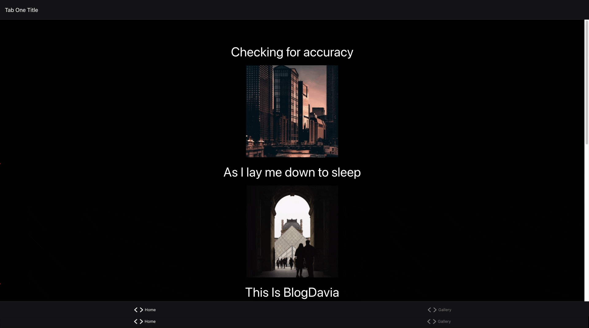

# react-native-stepzen

Install Expo
```
npm install -g expo-cli
```

Clone the repo
```
git clone https://github.com/davidleegriffin/step-cloud.git
```

set up dependencies
```
npm install
```

Manually add your admin key and uri in the App.tsx. Still working on adding .env variables to the build and development environments
```
const client = new ApolloClient({
	link: createHttpLink({
		credentials: "same-origin",
		headers: {
			Authorization: `Apikey {add_key}`,
		},
		uri: "{add_uri}",
	}),
	cache: new InMemoryCache(),
});
```

Next, in the stepzen folder make a config.yaml file similar to:
```
configurationset:
  - configuration:
      name: cloudinary_mutation
      api_key: <your cloudinary api key>
      api_secret: <your clodinary api secret here>
      cloud_name: <your cloudinary name here>
```

Start up StepZen
```
$ cd stepzen
$ stepzen start
```

In a new terminal, in project root folder start up the development environment
```
npm start
```

Download the expo App on your phone and scan the QR code or open it in your browser however, 
the browser will not show the posts content only the title and image, the content only displays 
on a mobile environment.


